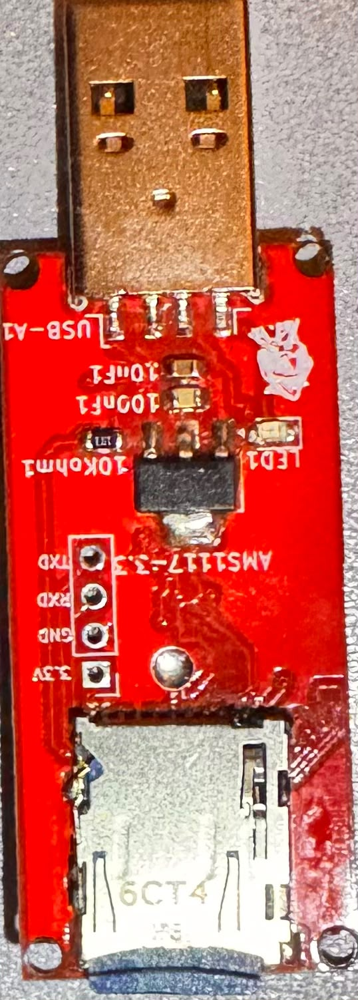
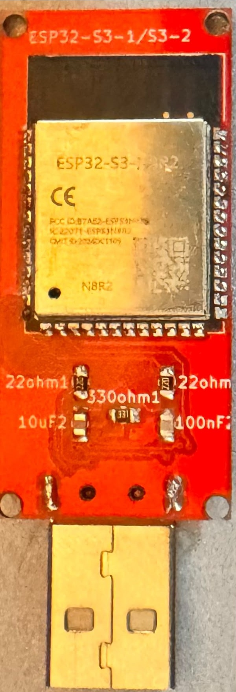

# Rubber-Ducky-ESP32 (Silicon Ghost)

A custom **ESP32-S3** based hardware testing and **HID (Human Interface Device)** emulation tool, packaged in a footprint that closely resembles a standard USB flash drive. Developed as an independent hardware research project, the primary objective was to explore PCB design, microcontroller architecture, and rapid manufacturing processes from schematic capture all the way through production ready fabrication files. The board operates as a programmable USB device capable of emulating keyboard and mouse input, running a **DuckyScript style payload interpreter** directly from a MicroSD card, with substantial onboard storage for complex scripts and payload sets.

---

## Table of Contents

- [Project Overview](#project-overview)
- [Hardware Gallery](#hardware-gallery)
- [Key Features](#key-features)
- [Hardware Specifications](#hardware-specifications)
- [Firmware](#firmware)
- [Payload Scripting Reference](#payload-scripting-reference)
- [Payload Staging on the SD Card](#payload-staging-on-the-sd-card)
- [Status LED Behavior](#status-led-behavior)
- [Storage and Payload Architecture](#storage-and-payload-architecture)
- [Design Methodology](#design-methodology)
- [Repository Contents](#repository-contents)
- [Manufacturing Instructions](#manufacturing-instructions)
- [Assembly Notes](#assembly-notes)
- [Flashing and First Use](#flashing-and-first-use)
- [Disclaimer](#disclaimer)
- [Author and License](#author-and-license)

---

## Project Overview

The device is a self contained USB peripheral built around the ESP32-S3 microcontroller. When connected to a host machine, it enumerates as a native composite USB HID (keyboard and mouse) and injects input events without requiring any driver installation or background software on the target system.

At boot it mounts a MicroSD card, scans for numbered `.txt` payload files, and executes them in order through an onboard interpreter that understands a DuckyScript style command set. The design prioritizes two things: a compact, unobtrusive form factor that mimics an ordinary flash drive, and enough removable storage to hold and stage large payloads made of several parts. Every design and manufacturing artifact required to fabricate, assemble, and program the board independently is included in this repository.

| Attribute | Detail |
|-----------|--------|
| Platform | ESP32-S3 microcontroller |
| Primary role | USB HID (keyboard / mouse) emulation |
| Payload source | Numbered `.txt` scripts on a MicroSD card |
| Interpreter | DuckyScript style command set with 5 keyboard layouts |
| Form factor | Compact, resembling a USB flash drive |
| Storage | High capacity onboard flash plus MicroSD expansion |
| Deliverables | Firmware, production ready Gerber, BOM, CPL, and 3D models |

---

## Hardware Gallery

The physical production result of the custom designed printed circuit board:

 

---

## Key Features

- **Native USB HID emulation** of keyboard and mouse input, executed directly by the ESP32-S3 with no host side drivers or software required.
- **DuckyScript style payload interpreter** running on the device, supporting strings, key combinations, modifiers, function keys, navigation keys, mouse movement, clicks, scrolling, delays, and loops.
- **Sequential payload execution**, where numbered `.txt` files on the SD card run one after another, so complex operations can be split across ordered scripts.
- **Five selectable keyboard layouts** (EN, TR, FR, DE, JP) for correct character mapping across regional hosts.
- **MicroSD expansion slot** for removable payload storage and easy field updates without reflashing.
- **High capacity module option**: the `ESP32-S3-WROOM-2-N32R8V` variant (32 MB flash / 8 MB PSRAM) maximizes onboard capacity, while the `N16R8` variant is a compatible alternative.
- **Status LED signaling** for ready, running, and error states.
- **Stable onboard power delivery** through an integrated 5 V to 3.3 V LDO regulator fed directly from the host USB port.
- **Fully documented for independent fabrication**, with verified Gerbers, a complete bill of materials, a placement file for automated SMT assembly, and 3D models for the board and enclosure.

---

## Hardware Specifications

| Component | Part | Package | Role |
|-----------|------|---------|------|
| Microcontroller | `ESP32-S3-WROOM-1` / `-2` (`N32R8V` recommended) | RF module | MCU, USB HID, SD interface, up to 32 MB flash / 8 MB PSRAM |
| Regulator | AP2112K-3.3 | SOT-23-5 | 5 V to 3.3 V LDO from host USB |
| SD connector | Hirose DM3AT-SF-PEJM5 | microSD | Removable payload storage |
| USB connector | Molex 48037-2200 | USB Type A horizontal | Host connection and power |
| Status LED | LED | 0805 | Ready / run / error signaling |
| Passives | 1x 10 kΩ, 2x 22 Ω, 1x 330 Ω resistors; 2x 10 µF, 2x 100 nF capacitors | 0805 | USB data termination (22 Ω), pull up, LED limiting, decoupling |

Full references and footprints are in [`Bad_Usb_Files/BAD_USB.csv`](Bad_Usb_Files/BAD_USB.csv); placement coordinates in [`Bad_Usb_Files/BAD_USB-all-pos.csv`](Bad_Usb_Files/BAD_USB-all-pos.csv).

### Firmware pin map

| Signal | GPIO |
|--------|------|
| SD chip select (CS) | 10 |
| SD MOSI | 11 |
| SD clock (SCK) | 12 |
| SD MISO | 13 |
| Status LED | 46 |

---

## Firmware

The firmware ([`Bad_Usb_Files/BAD_USB.ino`](Bad_Usb_Files/BAD_USB.ino)) is a single Arduino sketch built on the ESP32 Arduino core's native USB stack (`USB.h`, `USBHIDKeyboard.h`, `USBHIDMouse.h`) plus the `SD` library over SPI.

At boot it initializes the HID interfaces, mounts the SD card, and enters its run loop: it enumerates every numbered `.txt` file at the card root, sorts them numerically, and executes each line through the command interpreter. Character output is mapped through the currently selected keyboard layout so that symbols and accented characters land correctly on the host. After the last stage completes, the board idles.

---

## Payload Scripting Reference

Payloads are plain text scripts, one command per line. The interpreter supports:

| Command | Action |
|---------|--------|
| `REM <text>` | Comment, ignored at runtime |
| `STRING <text>` | Types the text using the active layout |
| `STRINGLN <text>` | Types the text, then presses Enter |
| `DELAY <ms>` | Pauses for the given milliseconds |
| `DEFAULT_DELAY <ms>` / `DEFAULTDELAY <ms>` | Delay inserted automatically after every command |
| `REPEAT <n>` | Repeats the previous command *n* times |
| `LAYOUT <code>` | Switches keyboard layout (`EN`, `TR`, `FR`, `DE`, `JP`) |
| Modifier combos | `CTRL`/`CONTROL`, `SHIFT`, `ALT`, `GUI`/`WINDOWS`, `RALT` combined with a key, e.g. `CTRL ALT DELETE` |
| Named keys | `ENTER`, `TAB`, `SPACE`, `ESC`/`ESCAPE`, `UP`, `DOWN`, `LEFT`, `RIGHT`, `CAPSLOCK`, `SCROLLLOCK`, `PAUSE`, `MENU`/`APP`, `F1` through `F24` |
| `MOUSE_MOVE <x> <y>` | Moves the cursor by a relative offset (split automatically into HID's ±127 range) |
| `MOUSE_CLICK <button>` | Clicks `LEFT`, `RIGHT`, or `MIDDLE` |
| `MOUSE_PRESS <button>` | Presses and holds a mouse button |
| `MOUSE_RELEASE` | Releases all mouse buttons |
| `MOUSE_SCROLL <amount>` | Scrolls the wheel (positive up, negative down) |

Example payload:

```text
REM Open a terminal and print a message
DEFAULT_DELAY 50
GUI r
DELAY 500
STRINGLN cmd
DELAY 800
STRINGLN echo Silicon Ghost was here
```

---

## Payload Staging on the SD Card

- Payload files live at the **root of the SD card** and must be named with digits only, plus the `.txt` extension: `1.txt`, `2.txt`, `10.txt`, and so on.
- At runtime the files are collected and sorted **numerically**, then executed in ascending order, so operations made of several parts can be split across ordered stages.
- Files whose names are not purely numeric are ignored, so notes and unrelated files on the card are safe to keep alongside payloads.
- Each stage resets to the `EN` layout at its start; issue a `LAYOUT` command inside the stage if another mapping is needed.
- If no valid numbered `.txt` files are found, the board signals an error via the status LED (see below).

---

## Status LED Behavior

| State | LED |
|-------|-----|
| Booting / HID init | Off |
| Ready, payloads running | Solid on |
| SD mount failure | Rapid blink (about 10 Hz) |
| No payloads found / read error | Slow blink (about 1 Hz) |
| All stages complete | Off (board idles) |

---

## Storage and Payload Architecture

Storage capacity was the central selection criterion for the main module. The `ESP32-S3-WROOM-2-N32R8V` was chosen specifically for its 32 MB of flash and 8 MB of PSRAM, ensuring the device can hold and execute large payloads without running into capacity limits. Where maximum capacity is not required, the `N16R8` variant remains fully compatible and fits the same footprint.

Beyond the onboard flash, the board exposes a MicroSD card terminal. This provides an expandable, removable storage tier, the primary payload source at runtime, suitable for external data logging and for staging larger or more numerous payloads than would comfortably fit in flash alone. It also allows payloads to be swapped in the field without reflashing the firmware.

---

## Design Methodology

To facilitate rapid prototyping and quickly validate the core concept, the initial schematics and trace routing were executed using **Fritzing**. While industry standard EDA tools are typically preferred for complex routing, prioritizing a rapid development tool was a calculated decision to accelerate the first hardware iteration. The resulting Gerber files have been thoroughly reviewed, validated, and are fully ready for production.

---

## Repository Contents

```text
.
├── Bad_Usb_Files/
│   ├── BAD_USB.ino                     Firmware. Arduino sketch: USB HID stack, SD payload loader,
│   │                                   DuckyScript style interpreter, 5 keyboard layouts, mouse commands
│   ├── BAD_USB.csv                     Bill of materials: references, quantities, footprints
│   ├── BAD_USB-all-pos.csv             Pick and place data: X/Y, rotation, board side for every component
│   ├── Bad_Usb_Gerber&Drill.zip        Fabrication package: copper, mask, paste, silkscreen, drill files
│   ├── Bad_Usb_Design.STEP             3D STEP model of the assembled PCB
│   └── Bad_Usb_Enclosure.step          3D STEP model of the flash drive enclosure
├── images/
│   ├── front.jpg                       Assembled board, component side
│   └── back.jpg                        Assembled board, reverse side
├── LICENSE                             MIT license
└── README.md                           This document
```

| File | Purpose |
|------|---------|
| `BAD_USB.ino` | The device firmware. Flash this to the ESP32-S3. |
| `BAD_USB.csv` (BOM) | Bill of materials: all surface mount components with footprints and references. |
| `BAD_USB-all-pos.csv` (CPL/POS) | Component placement file for automated SMT assembly. |
| `Bad_Usb_Gerber&Drill.zip` | Verified Gerber and Excellon drill files ready for PCB fabrication. |
| `Bad_Usb_Design.STEP` | 3D model of the assembled board for mechanical verification. |
| `Bad_Usb_Enclosure.step` | 3D model of the enclosure for printing or machining the flash drive shell. |

---

## Manufacturing Instructions

1. Provide the `Bad_Usb_Gerber&Drill.zip` archive to a standard PCB manufacturer.
2. For PCBA (Printed Circuit Board Assembly) services, supply `BAD_USB.csv` and `BAD_USB-all-pos.csv`.
3. Ensure the manufacturer specifies the `ESP32-S3-WROOM-2` module during assembly to maintain the intended high capacity storage architecture. The footprint is identical to the WROOM-1 series, requiring no physical alterations to the board design.
4. Use `Bad_Usb_Enclosure.step` to 3D print or machine the enclosure shell.

---

## Assembly Notes

- The `ESP32-S3-WROOM-2` and `WROOM-1` modules share an identical footprint, so substituting between them requires no changes to the PCB layout.
- Selecting the `N32R8V` module preserves the maximum capacity storage architecture; the `N16R8` variant is acceptable where a smaller flash budget is sufficient.
- The two 22 Ω resistors are the USB D+ and D− series terminations. Do not omit them.
- Power is derived entirely from the host USB port and regulated on the board, so no external supply is needed during operation.

---

## Flashing and First Use

1. Open `Bad_Usb_Files/BAD_USB.ino` in the Arduino IDE with the ESP32 board package installed.
2. Select an **ESP32-S3** board, and under Tools enable native USB (USB CDC and USB HID) and set the flash size to match your module.
3. Compile and upload to the board.
4. Format a MicroSD card as FAT32 and place your numbered payloads (`1.txt`, `2.txt`, and so on) at its root.
5. Insert the card and plug the device into the host. The status LED goes solid when payloads begin executing.

---

## Disclaimer

This hardware was developed strictly for **educational purposes and authorized security research**. It is not intended for use on systems, networks, or hardware without the explicit consent of the owner. The author assumes no liability for any misuse or damage caused by the fabrication or deployment of this design.

---

## Author and License

Developed by **Doruk Erel**, [dorukerel.com](https://dorukerel.com).

Released under the **MIT License**. See the [`LICENSE`](LICENSE) file for the full text.
